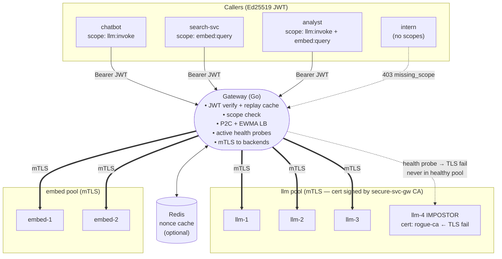

# Secure Service Gateway

A **production-shaped** Go reverse proxy that authenticates callers with
Ed25519 JWTs, authorises them with a per-route scope model, verifies backend
identity with mTLS + CA + SAN pinning, load-balances across healthy replicas
with P2C + EWMA, and emits structured logs and Prometheus metrics for every
decision.

The demo scenario is an internal AI model platform (LLM completion + embedding
pools), but the gateway is service-agnostic — swap the route config and it
fronts payments, orders, or any other internal service.

---

## Quick start — two commands to run everything

### Option A — Docker Compose (fastest, recommended for evaluation)
Zero cluster setup. Runs in ~90 seconds.

```bash
make demo && make test
```

`make demo` generates crypto material, builds images, and starts the full stack
(gateway + 6 backends + Redis). `make test` runs the full pytest suite inside
the compose network and prints a pass/fail summary.

### Option B — Kind cluster (full production topology)

#### (a) Build everything locally (no registry needed)
```bash
make demo-local      # kind cluster + local build + helm install + CR apply + pytest
```

#### (b) Pull pre-built images from GHCR (no Go/Docker build needed)
```bash
make demo-ghcr       # kind cluster + ghcr.io pull + helm install + CR apply + pytest
```

Both options install the gateway via Helm, apply the `SecureServiceGateway` CR
which drives the controller to reconcile config + NetworkPolicy, and run the
full 44-test pytest suite.

---

### Which to use?

| | Docker Compose | Kind |
|---|---|---|
| **Prerequisites** | Docker only | Docker + kind + helm + kubectl |
| **Time to first test** | ~90 s | ~10 min |
| **NetworkPolicy enforcement** | No (Linux iptables only) | Yes (Calico) |
| **Multi-replica gateway** | No | Yes (2 pods) |
| **CR-driven config** | No | Yes (controller watches CR) |
| **Recommended for** | Evaluation, dev iteration | Production-topology validation |

Use Docker Compose to evaluate correctness and security reasoning. Use Kind
when you want to validate the full Kubernetes control plane path including
NetworkPolicy, cert-manager, and the CRD controller.

---

---

## Design

### Security reasoning

| Decision | Why |
|---|---|
| **Ed25519 JWT only** | A single algorithm pin eliminates the `alg:none` / HMAC↔RSA confusion family. Ed25519 is fast (< 60 µs verify), has no parameters, and its public keys are 32 bytes. |
| **`jti` replay cache** | A signed token that can be replayed is only as good as its `exp`. Every `jti` is stored (in-memory or Redis `SET NX EX`) for the token's lifetime; a second use returns `reason=replay`. Redis `SET NX` is atomic, so there is no race window even across replicas. |
| **clockSkew window** | Clocks diverge. A ±5 s window is accepted before `iat`; tokens with `exp` already passed are rejected immediately. `nbf` is checked when present. |
| **mTLS with CA + SAN pinning** | Backend identity is proven at the TLS layer before application code runs. `tls.Config{RootCAs: <our CA>, ServerName: <service name>}` means even a cert signed by the right CA but with a different SAN is rejected — a concrete defence against spoofed-replica attacks. |
| **Scope-per-route** | `required_scope` is part of the route config, not the token. Callers cannot self-elevate by choosing a different scope; only the gateway config decides what a route requires. |
| **Fail-closed Redis** | `RedisNonceStore.CheckAndStore` returns `false` on any Redis error. A nonce cache outage blocks new requests rather than letting replays through. |
| **P2C + EWMA load balancing** | Power-of-Two Choices is O(1), avoids thundering-herd problems, and naturally drains slow backends. EWMA alpha=0.3 reacts quickly to latency spikes. Score resets on recovery so a stale high-latency EWMA does not starve a just-recovered backend. |

### Decision pipeline

```
HTTP request from caller
        │
┌───────▼──────────────────────────────────────────────┐
│  1. ROUTE MATCH       prefix → {service, scope}      │  404  no route
│  2. AUTHENTICATION    Ed25519 JWT verify              │  401  no_token / unknown_kid /
│       alg=EdDSA pinned, kid lookup, signature,        │       bad_signature / expired /
│       iss/aud/exp/iat, clockSkew, jti replay cache    │       not_yet_valid / replay
│  3. AUTHORISATION     required_scope ∈ token.scope[] │  403  missing_scope
│  4. BACKEND SELECTION P2C + EWMA over healthy set    │  503  no healthy backends
│  5. mTLS DIAL         RootCAs=CA, ServerName=svc     │  502  TLS/handshake failure
│  6. FORWARD           strip Authorization             │
│       add X-Forwarded-Sub, X-Request-Id               │
└──────────┬──────────────────────────────────────────┬─┘
           ▼ slog JSON line                            ▼ Prometheus
             decision=allow|deny|route                  gateway_requests_total
             reason=ok|expired|replay|…                 gateway_auth_failures_total
                                                        gateway_backend_healthy
                                                        gateway_upstream_latency_seconds
```

### Networking decisions

The gateway makes the following networking decisions on every request, in order, before forwarding any bytes to a backend:

| Decision | How |
|---|---|
| **Prefix routing** | URL prefix → service pool (`/v1/llm` → `llm`, `/v1/embed` → `embed`). Unknown prefixes get 404 before any auth work. |
| **Backend instance selection** | P2C + EWMA over the *healthy* set only. Two candidates are sampled at random; the one with the lower weighted score (EWMA latency × in-flight count) wins. Unhealthy backends are never sampled. |
| **Health-based exclusion** | Active HTTP GET probe over mTLS every 2 s. `failThreshold=3` consecutive failures eject a backend from the pool; `passThreshold=2` consecutive successes re-admit it. The probe uses the **same** `*tls.Config` as live traffic — a bad cert or unreachable pod is caught here before any client request lands on it. |
| **mTLS to every backend** | TLS 1.2 minimum. Mutual auth: the gateway presents a client cert; the backend must present a cert (a) signed by the internal CA **and** (b) whose SAN includes the service name. A cert from the right CA but wrong SAN, or any self-signed cert, causes a TLS handshake error → 502. No traffic flows until this passes. |
| **Header sanitisation** | `Authorization` is stripped (the backend never sees the caller's JWT). `X-Forwarded-Sub` (the verified `sub` claim) and `X-Request-Id` are injected so backends know who is calling without trusting the wire. Inbound `X-Forwarded-For` / `X-Real-IP` are deliberately not forwarded into auth decisions — bypass attempts tested in `test_10_header_attacks.py`. |
| **Optional listener TLS** | When `tls.enabled=true`, the gateway terminates TLS on the client-facing side using a cert-manager-issued cert (`ListenAndServeTLS`). All decisions above apply identically regardless of whether the caller connected over HTTP or HTTPS. |

What the gateway does **not** do (explicit trade-offs): rate limiting, retries, circuit-breaking beyond health ejection, or L4/TCP-level routing. Those belong in a service mesh or ingress layer above this gateway.

### Performance (Apple M-series, arm64)

Measured with `go test -bench -benchmem -benchtime=2s`:

| Path | Throughput | Latency | Allocs |
|---|---|---|---|
| `BenchmarkVerify` (single-core) | ~17 000 req/s | ~58 µs/op | 35 allocs, 1880 B |
| `BenchmarkVerify_Parallel` (10 cores) | ~112 000 req/s | ~9 µs/op | — |
| `BenchmarkPool_Pick` (P2C, parallel) | ~5 000 000 req/s | ~197 ns/op | 1 alloc, 32 B |

JWT verify cost is dominated by the Ed25519 scalar multiply (~50 µs). P2C
pick is essentially free at 197 ns.

---

## Getting started

Three stages, each self-contained. Pick how far you want to go.

---

### Stage 1 — Build and unit test (no Docker required)

```bash
# Compile the gateway binary and the cert/key generator
make build

# Run all Go unit tests with the race detector
make unit
# or with verbose output and specific packages:
go test -race -v ./internal/auth/... ./internal/lb/... ./internal/health/... ./internal/proxy/...

# Run benchmarks
go test -run='^$' -bench=BenchmarkVerify    -benchmem -benchtime=2s ./internal/auth/...
go test -run='^$' -bench=BenchmarkPool_Pick -benchmem -benchtime=2s ./internal/lb/...

# Fuzz for 30 s (JWT parser must never panic)
go test -fuzz=FuzzVerify -fuzztime=30s ./internal/auth/...
```

Expected output: all tests pass, race detector clean, benchmarks print `ns/op`.

---

### Stage 2 — Docker Compose (live stack, no cluster required)

```bash
# Generate CA, TLS certs, Ed25519 client keys, and config/gateway.yaml
make certs

# Build all container images and start the stack:
# gateway + llm-1/2/3 + llm-4(impostor) + embed-1/2 + Redis
make up

# Smoke-check: gateway metrics endpoint should return 200
curl -sf http://localhost:9090/metrics | grep gateway_backend_healthy

# Make a real call
make chat     # analyst → /v1/llm/completions  (200)
make attack   # intern (no scopes) → /v1/llm/completions  (403)

# Watch the decision log stream
make logs
# filter in another terminal:
docker compose logs -f gateway | jq 'select(.decision=="deny") | {reason,sub,route}'
```

Run the pytest integration suite against the running stack:

```bash
make test
# pytest runs inside a container on the compose network.
# test_07 (Redis fail-closed) is skipped unless GATEWAY_USES_REDIS=1 is passed
# — the default compose stack uses in-memory nonce cache.
```

One-shot compose cycle (certs → up → smoke, no pytest):

```bash
make demo
```

Tear down:

```bash
make down
```

---

### Stage 3 — Kind cluster (full integration, mirrors production)

One command does everything:

```bash
make kind-full
```

Expands to:

| Step | Command run internally | What it does |
|---|---|---|
| 1 | `make kind-up` | Creates 2-node kind cluster, installs Calico CNI, installs cert-manager v1.16.3 |
| 2 | `make certs` | Generates CA, TLS certs, Ed25519 client keys |
| 3 | `make images-load` | Builds `secure-svc-gw:dev` and `secure-svc-backend:dev`, loads into kind |
| 4 | `make helm-install-backends` | Deploys `llm-{1,2,3,4}` + `embed-{1,2}` + NetworkPolicy into `ai-services` |
| 5 | `make helm-install-gateway` | Deploys gateway + Redis into `secure-svc-gw` |
| 6 | `make test-kind REDIS=1` | `kubectl port-forward` 8080/9090, runs full pytest suite |

Flags:

```bash
make kind-full                  # defaults: REDIS=1, TLS=0
make kind-full REDIS=0          # in-memory nonce cache (test_07 skipped)
make kind-full TLS=1            # also enable HTTPS listener (cert-manager issues cert)
```

Run only the tests against an already-running cluster:

```bash
make test-kind          # without Redis nonce tests
make test-kind REDIS=1  # with Redis nonce tests (test_07)
```

Tear down:

```bash
make kind-down    # delete the kind cluster
make kind-reset   # delete + rebuild from scratch (kind-down + kind-full)
```

---

## Test suite

### Commands

```bash
# Go unit tests — no cluster required, race detector on
go test -race -count=1 ./...
go test -race -v ./internal/auth/... ./internal/lb/... ./internal/health/... ./internal/proxy/...

# benchmarks
go test -bench=BenchmarkVerify    -benchmem -benchtime=5s ./internal/auth/...
go test -bench=BenchmarkPool_Pick -benchmem -benchtime=5s ./internal/lb/...

# fuzz (runs until Ctrl-C or -fuzztime elapses)
go test -fuzz=FuzzVerify -fuzztime=30s ./internal/auth/...

# integration — docker compose (fastest)
make test

# integration — kind cluster (port-forward + kubectl exec)
make test-kind

# single file or test
docker compose --profile test run --rm tests -k test_07_redis_restart
GATEWAY_URL=http://localhost:8080 .venv/bin/pytest tests/test_09_http_fuzzing.py -v

# latency thresholds (configurable)
P50_THRESHOLD_MS=100 P95_THRESHOLD_MS=300 P99_THRESHOLD_MS=500 \
  .venv/bin/pytest tests/test_12_perf_latency.py -v -s
```

### Test matrix

| Test / File | Kind | Concern | What it validates |
|---|---|---|---|
| `TestVerify_HappyPath` … `TestVerify_WrongIssuer` (10 cases) | unit | Auth — JWT | One test per rejection reason: `no_token`, `unknown_kid`, `bad_signature`, `expired`, `not_yet_valid`, `wrong_issuer`, `wrong_audience`, `missing_jti`, `bad_claims` |
| `TestVerify_AlgNone` / `AlgHS256` / `AlgRSA` | unit | Auth — alg confusion | Tokens with `alg` ≠ `EdDSA` are rejected before key lookup |
| `TestVerify_TamperedHeader` / `TamperedPayload` / `TamperedSig` | unit | Auth — integrity | Single-byte flip anywhere in the JWT → `bad_signature` |
| `TestVerify_MalformedJWT` / `BadBase64Sig` / `BadJSONPayload` | unit | Auth — input safety | Malformed tokens never panic |
| `TestVerify_Concurrent` (200 goroutines) | unit | Auth — concurrency | Verify is safe under `-race`; all 200 accepted independently |
| `FuzzVerify` | fuzz | Auth — input safety | Arbitrary byte sequences never cause a panic or 5xx |
| `BenchmarkVerify` / `BenchmarkVerify_Parallel` | bench | Auth — perf | ~58 µs single-core, ~9 µs at 10 cores |
| `TestNonce_NewToken` / `SameToken` / `ExpiredToken` | unit | Replay — in-memory | Second use of same `jti` → rejected; expired entry → accepted as new |
| `TestNonce_ConcurrentReplay` (100 goroutines, same JWT) | unit | Replay — race | Exactly 1 goroutine succeeds; all others → `replay` under `-race` |
| `TestRedisNonce_New` / `SameToken` / `TTLExpiry` | unit | Replay — Redis | `SET NX EX` semantics via miniredis; `FastForward` confirms TTL expiry |
| `TestRedisNonce_Unavailable` | unit | Replay — fail-closed | Redis error → `false` (blocks request); never silently allows replay |
| `TestRedisNonce_ConcurrentReplay` (50 goroutines) | unit | Replay — Redis race | Single atomic `SET NX`; only one goroutine wins under `-race` |
| `TestPool_Distribution` / `DistributionFavorsLowLatency` | unit | LB — P2C | 1000 picks: fast backends get ≥ 80 % of traffic; slow/unhealthy get none |
| `TestPool_InflightWeighting` / `EWMAReset` / `RecoveringBackendSelected` | unit | LB — EWMA | Score resets to 1.0 on recovery; in-flight count breaks ties |
| `TestPool_NoneHealthy` / `SingleHealthy` | unit | LB — edge cases | 503-equivalent when all backends down; single healthy always selected |
| `TestPool_Race` (concurrent pick + health flip) | unit | LB — concurrency | No data races under `-race` |
| `BenchmarkPool_Pick` | bench | LB — perf | ~197 ns/op, 1 alloc |
| `TestChecker_ThreeFailuresEjectBackend` / `TwoSuccessesRestoreBackend` | unit | Health — thresholds | Exact ejection + re-admission counts |
| `TestChecker_NoFlapSuccessInterrupted` / `FailuresArePerBackend` | unit | Health — isolation | Success streak reset by one failure; counters are per-backend |
| `TestChecker_ProbeHealthy` / `ProbeSick` / `ProbeUnreachable` | unit | Health — live HTTP | `httptest.Server` verifies real HTTP probes over loopback |
| `TestBackendTLS_MissingCA` / `InvalidCA` / `MissingCertFile` / `MismatchedCertKey` | unit | Proxy — TLS errors | Each misconfiguration returns a clear error; no partial state |
| `TestBackendTLS_ValidConfig` | unit | Proxy — TLS happy path | Config enforces `MinVersion=TLS12`, ServerName, RootCAs, client cert |
| `test_01_happy_path.py` | integration | E2E — happy path | Analyst → LLM + embed; HTTP 200; `X-Upstream` ∈ `{llm-1,2,3}`; metrics +1 |
| `test_02_authorization.py` | integration | Authz | `no_token` 401; `unknown_kid` 401; empty scope 403; wrong-service scope 403 |
| `test_03_backend_identity.py` | integration | mTLS / impostor | `llm-4` (rogue CA) never healthy; 20 calls never land on it |
| `test_04_health_shifting.py` | integration | Health shifting | Break → eject → restore → re-admit; verified via metrics + `X-Upstream` |
| `test_05_credential_attacks.py` | integration | Credential attacks | Tampered sig / expired / replayed `jti` / wrong audience → each 401 |
| `test_06_observability.py` | integration | Observability | All 5 Prometheus series present; `gateway_backend_healthy` for every backend |
| `test_07_redis_restart.py` | integration | Replay — Redis outage | Redis down → fail-closed 401; restart → requests succeed again |
| `test_08_cert_tls.py` | integration | TLS — cert quality | Cert not expired; TLS ≥ 1.2; hostname matches SAN; `requests verify=True` works |
| `test_09_http_fuzzing.py` | integration | Input safety | 50× random tokens, binary, 100 KB, random routes, random bodies → never 5xx |
| `test_10_header_attacks.py` | integration | Header attacks | `X-Forwarded-For` / `X-Real-IP` bypass attempts; duplicate `Authorization` (raw socket); `Content-Length` smuggling probe |
| `test_11_replay_stress.py` | integration | Replay — stress | 100 threads × same JWT → exactly 1 success; `gateway_auth_failures_total{reason=replay}` delta matches |
| `test_12_perf_latency.py` | integration | Latency SLOs | P50 < 500 ms, P95 < 1000 ms, P99 < 2000 ms (configurable via env vars); ASCII histogram printed with `-s` |

---

## Architecture



---

## How each requirement is demonstrated

### 1 — Legitimate client reaches a healthy backend
[tests/test_01_happy_path.py](tests/test_01_happy_path.py)

`analyst` holds a keypair registered in `client_keys` with scopes
`[llm:invoke, embed:query]`. Test mints a fresh Ed25519 JWT and calls
`POST /v1/llm/completions`. Asserts: HTTP 200, `X-Upstream` names one of
`llm-1..3`, and `gateway_requests_total{decision="allow"}` increments.

### 2 — Unauthorised client is rejected
[tests/test_02_authorization.py](tests/test_02_authorization.py)

| Attack | HTTP | `gateway_auth_failures_total{reason=…}` |
|---|---|---|
| No Authorization header | 401 | `no_token` |
| Valid sig, unknown `kid` | 401 | `unknown_kid` |
| Valid JWT, empty scope | 403 | `missing_scope` |
| `chatbot` calls `/v1/embed` (wrong scope) | 403 | `missing_scope` |

### 3 — Backend identity is verified before traffic is sent
[tests/test_03_backend_identity.py](tests/test_03_backend_identity.py)

`llm-4` serves a cert signed by `rogue-ca.crt`. Every health probe's TLS
handshake fails at CA verification. After 3 failures
`gateway_backend_healthy{backend="llm-4"} == 0`. 20 client calls never
set `X-Upstream: llm-4`.

### 4 — Traffic shifts from unhealthy backend and recovers
[tests/test_04_health_shifting.py](tests/test_04_health_shifting.py)

Calls `/admin/break?fail=1` on `llm-2` (via `docker exec` / `kubectl exec`).
After 3 failed probes `llm-2` is ejected. After `/admin/break?fail=0` and 2
passing probes `llm-2` is re-admitted. Asserted via metrics and `X-Upstream`.

### 5 — Negative security cases
[tests/test_05_credential_attacks.py](tests/test_05_credential_attacks.py)

| Attack | Rejection reason |
|---|---|
| Tampered JWT signature | `bad_signature` |
| Expired JWT | `expired` |
| Replayed `jti` (3×) | `replay` |
| Wrong audience | `wrong_audience` |
| Spoofed backend cert (test 3) | TLS handshake |

### 6 — Observability for every decision
[tests/test_06_observability.py](tests/test_06_observability.py)

Every request → one JSON log line with `decision`, `reason`, `route`,
`target_service`, `upstream`, `sub`, `request_id`, `code`.
All 5 Prometheus series exposed. `gateway_backend_healthy` gauge present for
every configured backend including the impostor.

---

## Failure handling

| Failure | Gateway behaviour | Test |
|---|---|---|
| Backend cert signed by wrong CA | Probe fails → ejected, never receives traffic | `test_03_backend_identity.py` |
| Backend goes unhealthy (3 probes fail) | Ejected from P2C pool → 503 if all down | `test_04_health_shifting.py` |
| Backend recovers (2 probes pass) | Re-admitted, EWMA reset | `TestChecker_TwoSuccessesRestoreBackend` |
| JWT expired | 401 `reason=expired` | `TestVerify_Expired`, `test_05` |
| JWT replayed | 401 `reason=replay` | `TestNonce_ConcurrentReplay`, `test_11_replay_stress` |
| Redis unreachable | 401 `reason=replay` (fail-closed) | `TestRedisNonce_Unavailable`, `test_07_redis_restart` |
| Redis restarts | Gateway reconnects lazily; requests succeed again | `test_07_redis_restart.py` |
| Algorithm confusion (HS256 / RS256 / none) | 401 `reason=bad_claims` | `TestVerify_AlgNone`, `TestVerify_AlgHS256`, `TestVerify_AlgRSA` |
| Tampered JWT (header / payload / sig) | 401 `reason=bad_signature` | `TestVerify_TamperedPayload` |
| No healthy backends | 503 | `TestPick_NoneHealthy` |
| Garbage / oversized input | 400 or 401, never 5xx | `FuzzVerify`, `test_09_http_fuzzing.py` |

---

## CI and GHCR images

### Will pushing my changes push images to the registry?

**Yes, if you push to `main`.** The CI pipeline has four jobs:

| Job | Trigger | Pushes images? |
|---|---|---|
| `unit` | every push + PR | no — Go tests only |
| `build-push` | every push + PR | **yes, on `main` only** — pushes `:latest` and `:<git-sha>` to GHCR |
| `smoke` | every push + PR | no — compose up + curl check only |
| `integration-kind` | `main` pushes only | no — consumes images that `build-push` just pushed |

PRs build images but do **not** push them. Only merging to `main` publishes to the registry.

### First-time GHCR setup

GHCR packages are **private by default**. After the first push:

1. Go to `https://github.com/nitinbhat?tab=packages`
2. Open `secure-svc-gw` and `secure-svc-backend`
3. Package settings → **Change visibility → Public**

Once public, `make images-pull` and `make kind-full` (via `images-pull`) work for anyone without authentication.

### Push images manually

```bash
# Log in once (use a PAT with write:packages scope, or GitHub CLI)
echo $GITHUB_TOKEN | docker login ghcr.io -u nitinbhat --password-stdin

make ghcr-push                    # build + push :latest
make ghcr-push IMAGE_TAG=v0.2.0   # explicit version tag
```

Images land at:
- `ghcr.io/nitinbhat/secure-svc-gw:<tag>`
- `ghcr.io/nitinbhat/secure-svc-backend:<tag>`

---

## Kind + Calico + Helm deployment

### What `make kind-up` installs

| Component | How | Why |
|---|---|---|
| 2-node kind cluster | `deploy/kind/up.sh` | Runs the gateway and backends on separate nodes |
| Calico CNI (VXLAN) | Calico operator manifest | Enables `NetworkPolicy` enforcement |
| cert-manager v1.16.3 | Helm install | Issues TLS certs for the optional HTTPS listener |

### Prerequisites

`kind`, `helm`, `kubectl`, `docker`, `python3` must be on PATH.

### One-shot (recommended)

```bash
make kind-full
```

This single target does everything: `kind-up` → `certs` → `images-load` → `helm-install-backends` → `helm-install-gateway --set redis.enabled=true` → `test-kind REDIS=1`.

Redis and TLS are flags:

```bash
make kind-full REDIS=1 TLS=1   # Redis + HTTPS listener (default: REDIS=1, TLS=0)
make kind-full REDIS=0          # in-memory nonce cache only (skips test_07)
```

### Step by step (for reference)

```bash
# 1. Kind cluster — Calico CNI + cert-manager v1.16.3
make kind-up

# 2. Generate CA, TLS certs, Ed25519 client keys
make certs

# 3. Build images and load into kind  (or: make images-pull to pull from GHCR)
make images-load

# 4. Install backends into `ai-services` (NetworkPolicy included)
make helm-install-backends

# 5. Install gateway into `secure-svc-gw` with Redis nonce cache
make helm-install-gateway GATEWAY_EXTRA_SET="--set redis.enabled=true"
#    add --set tls.enabled=true for HTTPS listener

# 6. Run the full pytest suite
#    REDIS=1 unlocks test_07 (Redis fail-closed + recovery)
make test-kind REDIS=1
```

Pull from GHCR instead of building locally (skip step 2-3, pull images CI just pushed):

```bash
make images-pull                         # pulls :latest
make images-pull IMAGE_TAG=<git-sha>     # pinned to a specific CI build
```

Tear down:

```bash
make helm-uninstall   # removes both Helm releases + namespaces
make kind-down        # deletes the kind cluster
# or in one shot:
make kind-reset       # kind-down + kind-full
```

### What runs in each pytest file and when

| File | Needs Redis (`REDIS=1`) | Needs kind | Notes |
|---|---|---|---|
| `test_01` – `test_06` | no | yes | Core requirements |
| `test_07_redis_restart` | **yes** | yes | `GATEWAY_USES_REDIS` must be set |
| `test_08_cert_tls` | no | yes + `TLS=1` | Skipped if `GATEWAY_URL` is not `https://` |
| `test_09_http_fuzzing` | no | yes | |
| `test_10_header_attacks` | no | yes | |
| `test_11_replay_stress` | no | yes | |
| `test_12_perf_latency` | no | yes | Thresholds via env vars |

### Namespace layout

| Namespace | Owned by | Contents |
|---|---|---|
| `secure-svc-gw` | Platform team | Gateway Deployment, ConfigMap, TLS Secrets, controller, Redis |
| `ai-services` | Product team | Backend Deployments + Services, per-pool TLS Secrets, NetworkPolicy |

NetworkPolicy in `ai-services` allows ingress only from pods carrying
`app.kubernetes.io/component: gateway` in the `secure-svc-gw` namespace.
Backend pods are not reachable from anything else on the cluster.

---

## CRD-based configuration

The `SecureServiceGateway` CRD (`gateway.secure-svc.io/v1alpha1`) makes every
config change a standard Kubernetes diff — auditable in git, reviewable in PRs,
rollback with `kubectl rollout undo`.

The controller (`cmd/controller`) watches `SecureServiceGateway` resources,
renders them into the `gateway-config` ConfigMap, and annotates the gateway
Deployment to trigger a rolling restart. It also creates a cert-manager
`Certificate` resource when `spec.tls.issuerRef` is set.

```bash
# Apply the sample CR
kubectl apply -f deploy/crds/sample-cr.yaml

# Watch the controller reconcile
kubectl -n secure-svc-gw logs -l app=secure-svc-gw-controller -f

# Check resource status
kubectl get ssg -n secure-svc-gw
```

**Sample CR:**

```yaml
apiVersion: gateway.secure-svc.io/v1alpha1
kind: SecureServiceGateway
metadata:
  name: main
  namespace: secure-svc-gw
spec:
  auth:
    issuer: secure-svc-gw
    audience: secure-svc-gw
    nonceTTL: 5m
    clientKeysSecretRef: gateway-client-keys

  backends:
    namespace: ai-services
    caSecretRef: gateway-certs
    clientCertSecretRef: gateway-certs
    failThreshold: 3
    passThreshold: 2
    healthInterval: 2s

  services:
    - name: llm
      healthPath: /healthz
      port: 8443
      backends: [llm-1, llm-2, llm-3, llm-4]
    - name: embed
      healthPath: /healthz
      port: 8443
      backends: [embed-1, embed-2]

  routes:
    - prefix: /v1/llm
      service: llm
      requiredScope: llm:invoke
    - prefix: /v1/embed
      service: embed
      requiredScope: embed:query
```

> **Note — TLS and Redis are Helm values, not CR fields.**
> The CR describes _what_ the gateway does (auth rules, backends, routes).
> _How_ it is deployed (listener TLS cert, Redis sidecar) is infrastructure
> configuration that belongs in Helm values:
>
> ```bash
> # cert-manager-issued listener cert
> helm upgrade secure-svc-gw deploy/helm/gateway \
>   --set tls.enabled=true
>
> # distributed Redis nonce cache
> helm upgrade secure-svc-gw deploy/helm/gateway \
>   --set redis.enabled=true
> ```

**Enable the controller:**

```bash
helm upgrade secure-svc-gw deploy/helm/gateway \
  --namespace secure-svc-gw \
  --set controller.enabled=true \
  --set controller.crName=main \
  -f clients/values-clients.yaml
```

---

## Observability

Every request produces one structured log line:

```json
{"time":"…","level":"INFO","service":"gateway","request_id":"a1b2c3",
 "decision":"allow","reason":"ok","route":"/v1/llm",
 "target_service":"llm","upstream":"llm-2","sub":"analyst","code":200}

{"time":"…","level":"WARN","service":"gateway",
 "decision":"deny","reason":"replay","route":"/v1/llm","sub":"analyst"}

{"time":"…","level":"WARN","service":"gateway",
 "decision":"route","reason":"backend_unhealthy","target_service":"llm",
 "upstream":"llm-4","err":"x509: certificate signed by unknown authority"}
```

Prometheus endpoint: `http://localhost:9090/metrics`

| Metric | Labels | What it tracks |
|---|---|---|
| `gateway_requests_total` | route, decision, reason | every allow / deny |
| `gateway_auth_failures_total` | reason | auth failure breakdown |
| `gateway_upstream_requests_total` | service, backend, code | per-backend traffic |
| `gateway_upstream_latency_seconds` | service, backend | P50/P95/P99 |
| `gateway_backend_healthy` | service, backend | 1 = healthy, 0 = ejected |

---

## Project layout

```
cmd/
  gateway/            HTTP entry point (main.go)
  controller/         CRD controller — watches SecureServiceGateway, reconciles ConfigMap
  gen-artifacts/      generates CA + certs + Ed25519 client keys + gateway.yaml

api/
  v1alpha1/types.go   Go types for SecureServiceGateway CRD (stdlib only, go 1.21)

internal/
  auth/               Ed25519 JWT verify + NonceStore (in-memory + Redis)
  lb/                 P2C + EWMA load balancer
  health/             active health checker (fail/pass thresholds, mTLS probe)
  proxy/              mTLS config + request handler + backend HTTP client
  config/             YAML config loader
  logging/            slog JSON handler
  metrics/            Prometheus counters / gauges / histograms

backend/              Python FastAPI (llm + embed personalities, /admin/break endpoint)
client/               Python client library + CLI (Ed25519 JWT mint, attack helpers)

tests/                pytest suite
  test_01_happy_path.py
  test_02_authorization.py
  test_03_backend_identity.py
  test_04_health_shifting.py
  test_05_credential_attacks.py
  test_06_observability.py
  test_07_redis_restart.py       Redis fail-closed + recovery
  test_08_cert_tls.py            TLS cert validity, version, hostname
  test_09_http_fuzzing.py        random tokens/routes/bodies → never 5xx
  test_10_header_attacks.py      header injection / smuggling probes
  test_11_replay_stress.py       100 concurrent same JWT → 1 success
  test_12_perf_latency.py        P50/P95/P99 latency + configurable thresholds

deploy/
  docker/             gateway.Dockerfile (golang:1.24-alpine → scratch)
  kind/               2-node kind config + Calico + cert-manager installer
  crds/               sample-cr.yaml
  helm/
    gateway/          secure-svc-gw chart (gateway + controller + Redis)
      crds/           SecureServiceGateway CRD
    backends/         secure-svc-backends chart
```

---

## Trade-offs made for demo brevity

- **Nonce cache defaults to in-process.** Enable Redis with `--set redis.enabled=true`
  for multi-replica replay safety. The `NonceStore` interface is the only seam.
- **Client-facing defaults to plain HTTP.** Set `--set tls.enabled=true` to enable
  HTTPS. In production you would also terminate TLS at an ingress; either way mTLS
  *to backends* is what proves identity.
- **`gen-artifacts` writes unencrypted keys to disk.** Replace with Vault / SPIRE /
  cert-manager in production.
- **Health checker is single-process.** For horizontal scale-out, share ejection state
  via the Kubernetes API or a shared pub/sub.
- **Backend adapters are fake.** `POST /completions` returns a canned response so
  assertions are deterministic. Swap in real provider SDKs behind the same HTTP contract.
- **Controller uses stdlib only** (no controller-runtime) to keep the go.mod at
  Go 1.21 without a `toolchain` directive bump.
